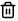

# Edit

## Architecture Portal – Editing Data

Edits to data within the Architecture Portal are live once saved. It is important that any change to the Portal is saved immediately and frequently, or the change may be lost. When two or more people are editing the same item simultaneously (e.g. two people editing “Adobe” under the Technologies entity at the same time), only the most recent save is recorded. This is not an issue when different items are edited simultaneously (e.g. one person editing “Adobe” and one person editing “Android” under the Technologies entity at the same time). 

## How do I Edit Data in the Portal

### Step 1 – Enter Editing Mode

1. Click on the top left dropdown menu

2. Click on “Edit” at the bottom of the menu

The message “You are editing live data – any changes you save will be seen by other users” will be displayed. The Portal is now in editing mode.

### Editing Information In an Item

### Step 2 – Edit Item

1. Click on “Entities” in the top left of the screen

2. Select entity to be edited

3. Select item to be edited

4. Click on the  icon on the right side of the item

5. Edit the fields as desired

6. Once editing is finished, click on the  icon on the right side of the screen

7. Wait until the icon goes grey  indicating save success

The changes will be saved. Click on any entity in the top left dropdown menu to exit editing mode and enter the Architecture Portal. Note, if the item name has been edited, the page may need to be refreshed for the changes to show.

### Deleting an Item

### Step 2 – Delete Item

1. Click on “Entities” in the top left of the screen

2. Select entity to be edited

3. Select item to be deleted

4. Click on the  icon on the right side of the item

5. Click on the  icon on the right side of the screen

6. Wait until the icon goes grey  indicating save success

The item will be removed. Click on any entity in the top left dropdown menu to exit editing mode and enter the Architecture Portal. Note, the page may need to be refreshed for the item to disappear from the entity’s list.

### Adding an Item

### Step 2 – Add Item

1. Click on “Entities” in the top left of the screen

2. Select entity to be edited

3. Click on the  icon on the left side of the screen

4. Set the ID and Name (compulsory) and any other information about the item

5. Click on the  icon on the right side of the screen

6. Wait until the icon goes grey  indicating save success

The item will be added. Click on any entity in the top left dropdown menu to exit editing mode and enter the Architecture Portal. Note, the page may need to be refreshed for the item to appear on the entity’s list.